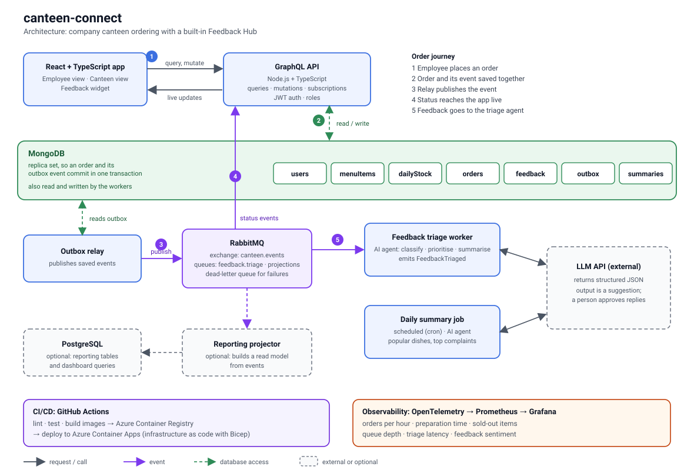
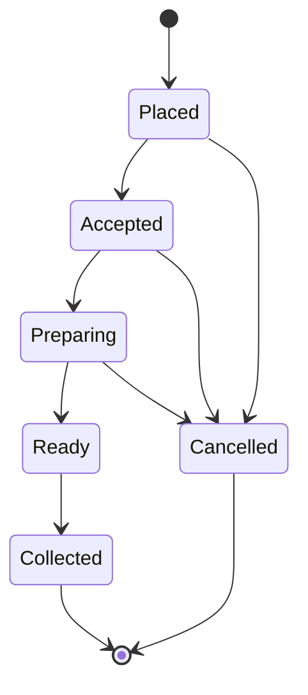
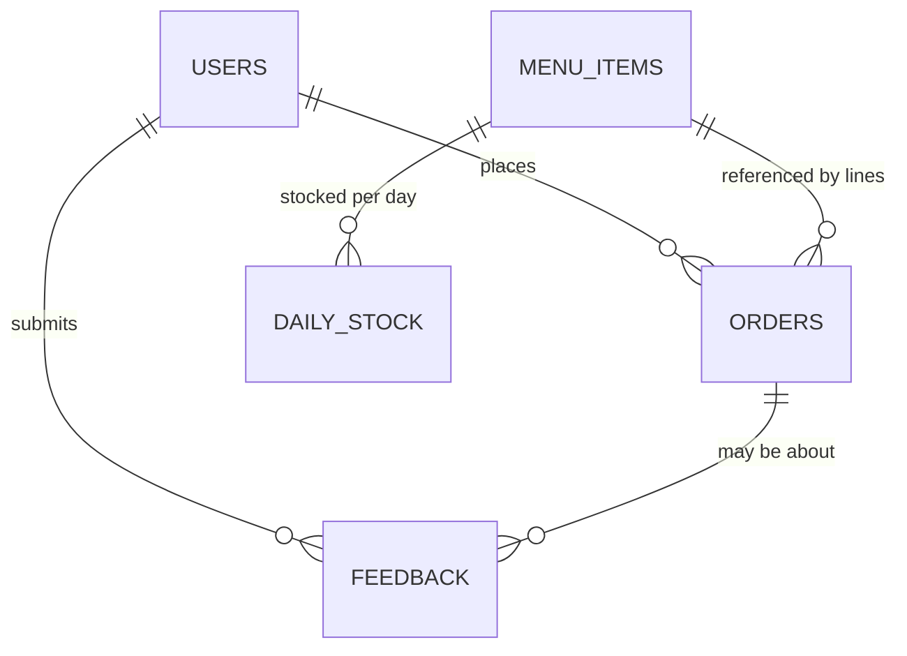

# canteen-connect: Design

Status: design draft for v1 (5 Oct 2026). No code yet.

canteen-connect is a web app for a company canteen. Employees browse the day's menu and order for a pickup slot. Canteen staff manage the menu and stock and move orders through preparation. A built-in Feedback Hub lets employees report problems and ideas, and an AI agent triages them for the staff.



## 1. Scope

Version 1 covers menu management, daily stock, ordering for a pickup slot, live order tracking, the Feedback Hub with AI triage, a daily summary for the canteen manager, and dashboards.

Version 1 does not cover payments (employees pay at the counter), delivery, integration with an HR or identity system, or dish photos. Each of those can be added later without changing the core design.

## 2. Roles

| Role | Can do |
|---|---|
| Employee | See the menu and stock, place and cancel their own orders (before acceptance), track them live, submit feedback |
| Canteen staff | Everything an employee can, plus manage menu items and daily stock, view the order queue, move orders through their states, cancel orders, work the feedback inbox and approve replies |
| Admin | Everything canteen staff can do, plus manage users and roles and see all dashboards |

Every GraphQL resolver checks the role from the signed token. The client hiding a button is never the access control.

## 3. Technology choices

| Area | Choice | Why |
|---|---|---|
| Frontend | React + TypeScript | One app with role-based views |
| API | Node.js + TypeScript, GraphQL (queries, mutations, subscriptions over WebSocket) | One typed contract for the app, live updates built in |
| Database | MongoDB (replica set) | Orders are natural documents; atomic conditional updates for stock; transactions for order plus event |
| Messaging | RabbitMQ | Topic exchange, durable queues, dead-lettering; Azure Service Bus is the managed alternative |
| Workers | Node.js + TypeScript | Same language and shared event types as the API |
| AI | An LLM API behind a small interface | Provider can be swapped; output is always validated |
| Cloud | Azure Container Apps (API, workers, scheduled job), Azure Container Registry | Serverless containers, jobs for scheduled work |
| Delivery | GitHub Actions, Bicep | Build, test and deploy from the repository |
| Observability | OpenTelemetry, Prometheus, Grafana | Metrics and traces from every service |

## 4. Order life cycle



An employee may cancel only while the order is `Placed`. Canteen staff may cancel in `Placed`, `Accepted` or `Preparing` and must give a reason. A cancellation returns the reserved quantity to stock. Each change is a compare-and-set: the update only applies if the order is still in the state the caller saw, so two staff members cannot move the same order in conflicting ways.

## 5. Data model (MongoDB)

Documents reference each other by id. The order embeds its lines and status history because they are always read and written together.



All money is stored as integer minor units (paise) with a currency code, never as floating point.

### users

| Field | Notes |
|---|---|
| `_id`, `email` (unique), `name` | |
| `passwordHash` | Argon2 or bcrypt. Replaced by an identity provider subject if SSO is added |
| `role` | `employee`, `canteen`, `admin` |
| `active`, `createdAt` | |

### menuItems (the catalogue)

| Field | Notes |
|---|---|
| `_id`, `name`, `description`, `category` | |
| `priceMinor`, `currency` | |
| `tags`, `allergens` | Arrays, for example `veg`, `spicy`, `nuts` |
| `isActive` | Hidden from new menus when false; old orders keep their own copy of the name and price |

### dailyStock (what is on offer on a given day)

| Field | Notes |
|---|---|
| `_id`, `date` (local date string), `menuItemId` | Unique on (`date`, `menuItemId`) |
| `quantityTotal`, `quantityRemaining` | `quantityRemaining` never goes below zero |
| `updatedAt` | |

### orders

| Field | Notes |
|---|---|
| `_id`, `pickupCode` | Short random code the employee shows at the counter |
| `userId`, `pickupDate`, `pickupSlot` (`start`, `end`) | |
| `lines[]` | Each has `menuItemId`, `name`, `quantity`, `unitPriceMinor`, `notes`, copied at order time |
| `totalMinor`, `status` | |
| `statusHistory[]` | Each has `status`, `at`, `by`, optional `reason` |
| `idempotencyKey` | Sent by the client; unique together with `userId` |
| `createdAt`, `updatedAt` | |

### feedback

| Field | Notes |
|---|---|
| `_id`, `userId`, optional `orderId` | |
| `message`, optional `rating` (1 to 5), optional `userCategory` | What the employee entered |
| `context` | Page, app version |
| `status` | `received`, `triaged`, `in_progress`, `resolved`, `closed` |
| `triage` | Written by the worker: `category`, `priority`, `sentiment`, `route`, `summary`, `duplicateOf`, `draftReply`, `safetyFlag`, `model`, `triagedAt` |
| `reply` | The approved reply: text, `approvedBy`, `approvedAt` |
| `createdAt`, `updatedAt` | |

### outbox

| Field | Notes |
|---|---|
| `_id` | The event id (UUID), also used by consumers to ignore duplicates |
| `type`, `aggregateType`, `aggregateId`, `payload`, `createdAt` | |
| `publishedAt` | Empty until the relay has published it |
| `attempts` | |

### summaries

| Field | Notes |
|---|---|
| `_id` (the date), `generatedAt` | |
| `stats` | Computed by code: orders, per-item counts, sold-out times, average preparation time |
| `narrative` | Written by the model from the stats and the day's feedback |
| `model`, `reviewedBy` | |

### Indexes

| Collection | Index | Purpose |
|---|---|---|
| `users` | unique `email` | Login |
| `dailyStock` | unique (`date`, `menuItemId`) | Menu for a day, atomic updates |
| `orders` | unique (`userId`, `idempotencyKey`) | Safe retries |
| `orders` | (`status`, `pickupDate`, `pickupSlot.start`) | Staff queue |
| `orders` | (`userId`, `createdAt` descending) | Order history |
| `feedback` | (`status`, `createdAt` descending) | Inbox |
| `outbox` | partial index on (`createdAt`) where `publishedAt` is empty | Relay polling |
| `outbox` | TTL on `publishedAt`, 7 days | Keeps the collection small |

## 6. Key mechanisms

### Placing an order

All of this happens in one MongoDB transaction:

1. For each line, run a conditional update on `dailyStock`: decrease `quantityRemaining` by the quantity only if it is at least that quantity. If any line matches no document, abort and report which item is sold out.
2. Insert the order with status `Placed`. A duplicate (`userId`, `idempotencyKey`) means the request is a retry; abort and return the existing order.
3. Insert an `OrderPlaced` event into `outbox`, and an `ItemSoldOut` event for any line that brought stock to zero.

The conditional update makes the last portion safe: two employees ordering it at once cannot both succeed.

Pickup slots are fixed-length windows (for example 15 minutes) and an order must be placed before a cut-off before the slot starts. Both values are configuration.

### Events: outbox and relay

The API never publishes to RabbitMQ directly. It saves events in `outbox` in the same transaction as the change they describe, so a state change and its event cannot disagree. A relay process reads unpublished rows in order, publishes them to the `canteen.events` exchange, and sets `publishedAt`. Delivery is therefore at least once, and every consumer must tolerate seeing an event twice (they ignore an `eventId` they have handled, or their update is naturally repeatable).

### Live updates

Each API instance has its own temporary queue bound to the exchange. When an order, menu or feedback event arrives, the instance pushes it to the GraphQL subscriptions of the matching clients: the owner of an order, and all staff for the queue.

## 7. Events

| Event | Published when | Consumers |
|---|---|---|
| `OrderPlaced` | An order is created | API instances (staff queue), projector |
| `OrderAccepted`, `OrderPreparing`, `OrderReady`, `OrderCollected`, `OrderCancelled` | Staff or employee changes the state | API instances (live updates), projector |
| `ItemSoldOut` | Stock reaches zero | API instances (menu), projector |
| `MenuUpdated` | Menu or stock changes | API instances |
| `FeedbackSubmitted` | Feedback is saved | Triage worker, API instances |
| `FeedbackTriaged` | The worker has written triage | API instances (staff inbox), projector |
| `DailySummaryGenerated` | The scheduled job finishes | API instances |

Every event carries `eventId`, `type`, `occurredAt`, `aggregateId` and a small payload. The shared event types live in one package used by the API and the workers. Messages that fail repeatedly go to a dead-letter queue and raise an alert.

## 8. GraphQL outline

This is the shape of the contract, not the full schema.

```graphql
enum Role { EMPLOYEE CANTEEN ADMIN }
enum OrderStatus { PLACED ACCEPTED PREPARING READY COLLECTED CANCELLED }
enum FeedbackStatus { RECEIVED TRIAGED IN_PROGRESS RESOLVED CLOSED }

type Query {
  me: User!
  menuForDay(date: String!): [DailyStock!]!
  myOrders(first: Int, after: String): OrderConnection!
  order(id: ID!): Order
  orderQueue(date: String!, status: [OrderStatus!]): [Order!]!      # staff
  feedbackInbox(status: [FeedbackStatus!], first: Int, after: String): FeedbackConnection!  # staff
  dailySummary(date: String!): DailySummary                          # staff
}

type Mutation {
  login(email: String!, password: String!): AuthPayload!
  placeOrder(input: PlaceOrderInput!): Order!                        # input includes idempotencyKey
  cancelOrder(id: ID!, reason: String): Order!
  advanceOrder(id: ID!, to: OrderStatus!): Order!                    # staff
  upsertMenuItem(input: MenuItemInput!): MenuItem!                   # staff
  setDailyStock(date: String!, menuItemId: ID!, quantity: Int!): DailyStock!  # staff
  submitFeedback(input: SubmitFeedbackInput!): Feedback!
  approveFeedbackReply(id: ID!, reply: String!): Feedback!           # staff
  setFeedbackStatus(id: ID!, status: FeedbackStatus!): Feedback!     # staff
}

type Subscription {
  orderUpdated(orderId: ID!): Order!         # the order's owner
  orderQueueChanged(date: String!): Order!   # staff
  menuChanged(date: String!): DailyStock!
  feedbackChanged: Feedback!                 # staff
}
```

Pagination uses cursors. The API limits query depth and cost, and rate-limits mutations per user.

## 9. Feedback Hub

Employees reach feedback from a button on every page, and from a prompt after an order is collected, which links the feedback to that order.

The triage worker consumes `FeedbackSubmitted`, sends the message and its non-identifying context to the LLM, and expects JSON that it validates before saving:

| Field | Values |
|---|---|
| `category` | `food_quality`, `portion`, `wait_time`, `menu_request`, `app_bug`, `service`, `other` |
| `priority` | `low`, `normal`, `high`, `urgent` |
| `sentiment` | `positive`, `neutral`, `negative` |
| `route` | `kitchen`, `manager`, `developer` |
| `summary` | One sentence |
| `duplicateOf` | An earlier feedback id, or empty |
| `draftReply` | A suggested reply, never sent automatically |
| `safetyFlag` | True for food safety, allergen or illness reports |

Rules the design depends on:

- The model's output is a suggestion. A staff member approves every reply before the employee sees it.
- A message that may concern food safety or an allergic reaction gets `urgent`, goes straight to the canteen manager, and gets no drafted reply. A keyword check runs in code in addition to the model's flag, so the escalation does not depend on the model alone.
- The employee's text is untrusted input. It is passed to the model clearly delimited as data, the output must match the schema or it is rejected, and the model has no tools that can change orders or menus.
- Names and email addresses are not sent to the model.
- If the model call fails or returns invalid output, the feedback stays `received`, appears in the staff inbox untriaged, and is retried.

The scheduled daily summary job computes the numbers with database aggregations and asks the model only to write the narrative from those numbers and the day's feedback summaries. A manager reads it; the model never states figures it computed itself.

## 10. Observability

Each service exports OpenTelemetry traces and Prometheus metrics. Grafana dashboards:

| Dashboard | Shows |
|---|---|
| Orders | Orders per hour, orders by status, time from `Placed` to `Ready` (median and 95th percentile), time until collected, cancellations |
| Menu and stock | Sold-out items and when, remaining stock by item |
| Events | Age of the oldest unpublished outbox row, queue depths, dead-letter count, consumer errors |
| Feedback | Submissions per day, triage latency, sentiment trend, share of triage results staff changed, LLM errors |
| API | Request rate, errors and latency per GraphQL operation, active subscriptions |

Targets to start with, to be adjusted once measured: the oldest unpublished outbox row under 5 seconds, and a live status update reaching the employee within 2 seconds of the staff action.

## 11. Delivery and environments

The repository is a monorepo:

```text
canteen-connect/
├── apps/web/            React + TypeScript app
├── services/api/        GraphQL API
├── services/worker/     outbox relay, triage worker, daily summary job
├── packages/events/     shared event types and validation
├── infra/               Bicep templates
├── docs/                diagrams
└── DESIGN.md
```

On every pull request GitHub Actions runs lint, type checks, unit tests, and integration tests against a MongoDB replica set and RabbitMQ in containers, builds the images, and checks the GraphQL schema for breaking changes. On merge to the main branch it pushes images tagged with the commit hash to Azure Container Registry and deploys to a dev environment. Promotion to production needs a manual approval. Secrets live in Azure Key Vault, accessed through managed identity, and the database user has only the permissions the services need. Indexes are created by a versioned script that runs on deploy.

## 12. Build order

| Step | Outcome |
|---|---|
| 1. Foundations | Repository, CI, login and roles, menu and daily stock management, React shell |
| 2. Ordering | Place order with stock and idempotency, staff queue, state changes, order history (polling for now) |
| 3. Events | Outbox, relay, RabbitMQ, live updates through subscriptions |
| 4. Feedback Hub | Widget, submit, staff inbox, triage worker with the LLM, approved replies, safety rule |
| 5. Observability | OpenTelemetry, Prometheus, the Grafana dashboards above |
| 6. Cloud | Bicep, Container Registry, Container Apps, dev and production environments |
| 7. Summary and polish | Daily summary job; optionally the reporting projector and PostgreSQL |
| 8. Real users | Colleagues use it; record feedback received and changes made |

## 13. Open questions

- Time zone, slot length, cut-off and whether each slot needs a capacity limit.
- What happens to orders nobody collects: expire them, and does stock return?
- Local accounts, or single sign-on from the start?
- Atlas or Cosmos DB for MongoDB, and RabbitMQ self-run or Azure Service Bus?
- Which LLM provider and model, and the monthly cost ceiling.
- Whether payments or a wallet are ever in scope.
- Allergen display rules: what must the menu always show?
